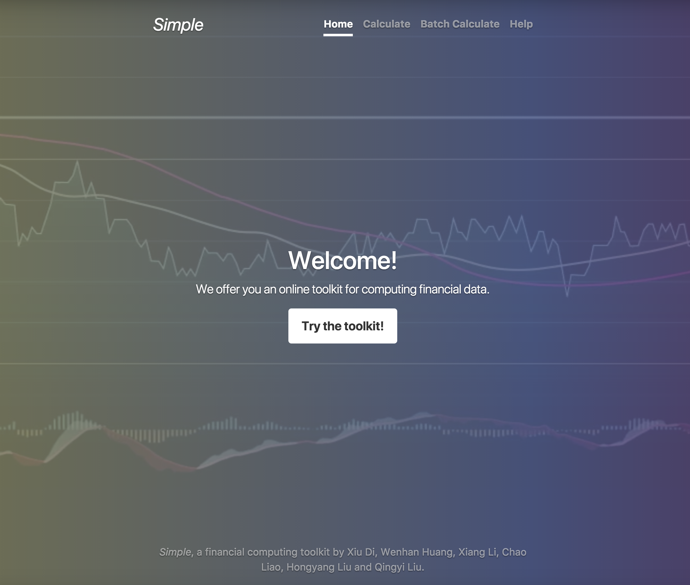

In order to implement a user-friendly web service, we make use of [Bootstrap](https://getbootstrap.com/) and [Flask](http://flask.pocoo.org/).

Bootstrap is a widely used front-end web framework which offers us a set of
tools for designing the interface. Based on it, we designed a interface below

Flask is python-based back-end web framework. We use it and Bootstrap to implement a complete web service.
